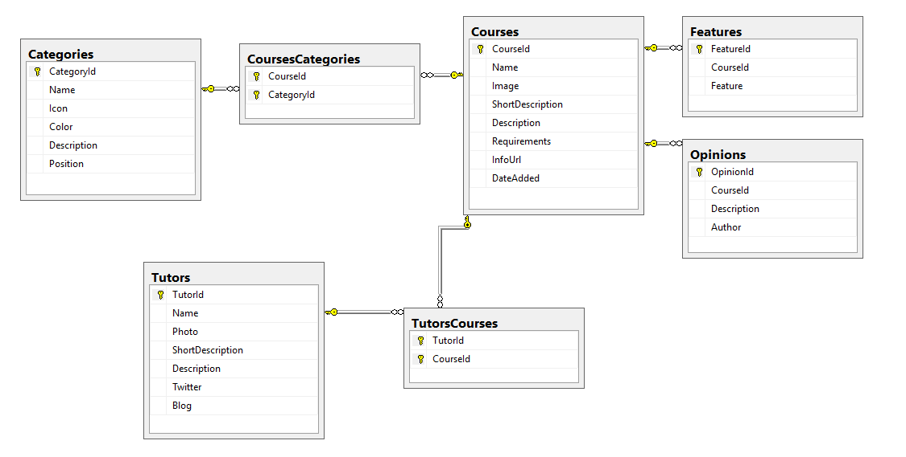

# campusMVPInfoAPI

Código fuente de la API REST que proporciona servicios de información sobre campusMVP.


Se trata de una **API sencilla** utilizada para **dar soporte a la aplicación móvil** de campusMVP, escrita con Xamarin. 

Ofrece información de categorías de cursos, cursos y tutores de [campusMVP.es](http://www.campusmvp.es).

Actualmente está albergada en [http://www.campusmvp.es/CatalogInfoSVC/](http://www.campusmvp.es/CatalogInfoSVC/).

Devuelve tanto XML como JSON según las cabeceras enviadas.

Está desarrollada con Visual Studio 2015, usando C#, Entity Framework DBFirst y WebAPI para .NET 4.x.

La base de datos es SQL Server.

## Base de datos

La siguiente imagen muestra el esquema de la base de datos, sus tablas, datos y relaciones:



Para generarla se ha incluido un archivo de código llamado **Generar-Esquema+Datos.sql** que contiene tanto la definición del esquema de la BBDD como los datos. En versiones futuras se añadirá otro archivo .sql solamente con los datos (sin el esquema) para poder actualizarlos sin regenerar la base de datos entera.

Para generar la base de datos solamente es necesario seguir los siguientes pasos:

1. **Abrir SQL Server Management Studio** (SSMS) y conectar con tu motor de bases de datos. Si usas LocalDB (incluido con Visual Studio) el nombre del servidor será `(LocalDB)\v11.0`.
1. **Abrir el archivo .sql** en SSMS
1. **Cambiar las rutas que tiene por defecto** para los archivos de datos y log, de modo que la base de datos se genere físicamente en el lugar adecuado. Por defecto la aplicación las buscará en su carpeta `App_Data` por lo que sería conveniente crear esa carpeta en el proyecto de Visual Studio e introducir la ruta a la misma en este *script*.
1. **Ejecutar el script**. Esto hará que se cree la base de datos, las tablas, las relaciones y que se llene con los datos de información de categorías, cursos, etc...

>**IMPORTANTE**: A la hora de que el servicio acceda a la base de datos, la cadena de conexión en `web.config` se denomina `Entities` y por defecto usará LocalDB con el archivo `CampusmvpAppInfo.mdf` ubicado como se ve en la carpeta `App_data` del proyecto. Si has instalado los datos en otro servidor deberás cambiar la cadena de conexión para poder acceder a los datos.

## Entidades
Las entidades que se devuelven a través del servicio se pueden encontrar en la carpeta `Models` del código, y son las siguientes:

- **Opinion**:

Se utiliza para obtener información de opiniones de alumnos sobre los cursos.

```csharp
public class Opinion
{
    public string Description { get; set; }
    public string Author { get; set; }
}

```

- **Tutor**:

Contienen información sobre los tutores asociados a los cursos.

```csharp
public class Tutor
{
    public int TutorId { get; set; }
    public string Name { get; set; }
    public string Photo { get; set; }
    public string ShortDescription { get; set; }
    public string Description { get; set; }
    public string Twitter { get; set; }
    public string Blog { get; set; }
}
```

> **Nota**: la imagen asociada a un tutor devuelve únicamente el nombre de ésta. Están ubicadas en la carpeta `imgs/tutors` del proyecto/servicio final.

- **Course**:

La información detallada de un curso, incluyendo opiniones y tutores.

```csharp
public class Course
{
    public int CourseId { get; set; }
    public string Name { get; set; }
    public string Image { get; set; }
    public string ShortDescription { get; set; }
    public string Description { get; set; }
    public string Requirements { get; set; }
    public string InfoUrl { get; set; }
    //Propiedades complejas
    public List<string> Features { get; set; }
    public List<Opinion> Opinions { get; set; }
    public List<Tutor> Tutors { get; set; }
}
```

> **Nota**: la imagen asociada a un curso devuelve únicamente el nombre de ésta. Están ubicadas en la carpeta `imgs/courses` del proyecto/servicio final.


- **Category**:

Información sobre una categoría de cursos del catálogo:

```csharp
public class Category
{
    public int CategoryId { get; set; }
    public string Name { get; set; }
    public string Icon { get; set; }
    public string Color { get; set; }
    public string Description { get; set; }
    public int Courses { get; set; }    //Número de cursos que tiene la categoría
}
```

> **Nota**: la imagen asociada a una categoría devuelve únicamente el nombre de ésta. Están ubicadas en la carpeta `imgs/categories` del proyecto/servicio final.

> **Nota 2**: el color de las categorías se devuelve en formato hexadecimal, apropiado para HTML, CSS y XAML, pero sin el `#` delante. Es decir, por ejemplo el color `#005670` se devolvería en la propiedad `Color` como `005670`.

## Métodos de la API

Los métodos disponibles en la API son los siguientes:

- **Obtener todas las categorías de cursos**: `Categories/`
- **Obtener los cursos de una categoría a partir de su id**: `CategoryCourses/{id}`
- **Obtener información de un curso concreto a partir de su id**: `Courses/{id}`

Se generan a través de su correspondiente controlador en la carpeta `Controllers`.

> **Nota**: Si alguna entidad que se solicita **no existe** se devuelve una entidad vacía y con el ID establecido a 0, **pero no se produce un error**. De este modo es fácil identificar cuando ocurre algo así sin necesidad de capturar una excepción.

Se recomienda probar la API usando alguna herramienta como la excelente **[Postman](https://www.getpostman.com/)**.
